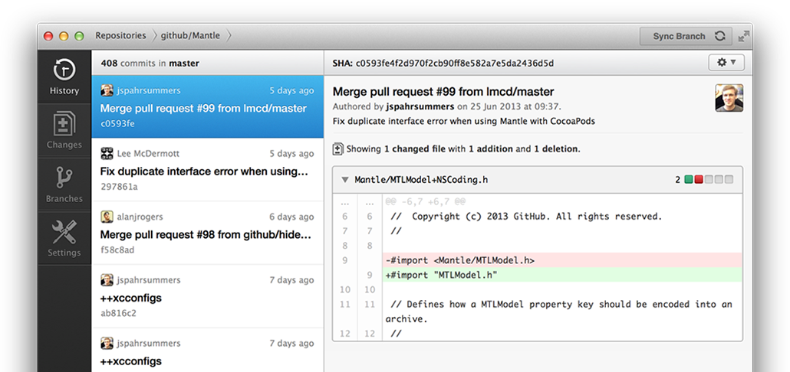
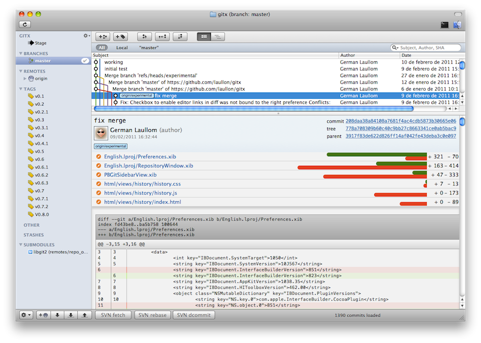

layout:       post
title:        Resources for Using Git
subtitle:     Some useful links for using Git
date:         2012-09-29 20:35
author:       Jamie Osborne
categories:   git tools
image:        promo-screenshot.png
web:          http://jmeosbn.github.io

Here's some basic resources to get started pushing code to github.

Note: As well as computer source code, git is useful for tracking changes to anything that can be represented as plain text, e.g. [German Law](http://www.wired.com/wiredenterprise/2012/08/bundestag/).

The simplest use of git is to create the repo locally, stored in the same folder as the source (known as the working tree) and named `.git`.

<!-- more -->

To [initialise](http://git-scm.com/docs/git-init) a new git repo, simply run `git-init`.

``` sh
$ cd my-project
$ git init
Initialized empty Git repository in my-project/.git/
```

[Add](http://git-scm.com/docs/git-add) any new or changed files you want to track, then [commit](http://git-scm.com/docs/git-commit) those changes to the repo.

``` sh
$ echo About My-Project > README.md
$ git add . # add all files recursively
$ git commit -m 'First Commit'
[master (root-commit) cdab15f] First Commit
 1 file changed, 1 insertion(+)
 create mode 100644 README.md
```

[View recent commits](http://git-scm.com/docs/git-log) using `git log`.

``` sh
$ git log
commit cdab15f2036b0b8b1c8fbfceab6357c8e56a0d5f
Author: Jamie Osborne <jmeosbn@your-email.com>
Date:   Sat Sep 29 23:30:20 2012 +0100

    First Commit
```

## documentation

Git itself can be installed from [git-scm.com](http://git-scm.com/downloads) if your OS doesn't already include it. The same site also hosts a copy of the [documentation](http://git-scm.com/docs), as well as the [Pro Git book](http://git-scm.com/book) which is a great place to start learning git.  Pro Git is also available as a commercially [printed book](http://www.amazon.com/gp/product/1430218339?ie=UTF8&tag=prgi-20&linkCode=as2&camp=1789&creative=390957&creativeASIN=1430218339) from Apress, and as a free [ePub](https://github.s3.amazonaws.com/media/progit.epub), [mobi](https://github.s3.amazonaws.com/media/pro-git.en.mobi), or [PDF](https://github.s3.amazonaws.com/media/progit.en.pdf) download.

If you don't fancy reading an entire book, then this [Git Tutorial](http://www.vogella.com/articles/Git/article.html) gets straight to the point for those already familiar with the concepts of version control.  There's minimal explanatory text, but full command examples for most operations; making it a useful resource for commands you use rarely and need to quickly relearn.

## graphical interfaces

While it's good to know how to use git from the command line, it's worth getting a GUI for easier building of commits etc. (you could also integrate it with your favourite editor and diff viewer)

[Github](http://github.com/) offers their own [Mac](http://mac.github.com/) and [Windows](http://windows.github.com/) GUI clients, which have the advantage of closer integration with some of github's features, such as organisations and the "Clone in Windows/Mac" button found on each repo on github.



They do lack some more advanced features though so I mostly prefer [GitX](http://gitx.laullon.com/) on the Mac, though [plenty more GUIs](http://git-scm.com/downloads/guis) exist on various platforms.



## other info

Btw, if you just want to share some code snippets somewhere while maintaining versioning etc., then check out [gists](https://gist.github.com/), a feature of github.

*This article was originally posted at: [http://jmeosbn.github.com](http://jmeosbn.github.com/blog/resources-for-using-git/)*
